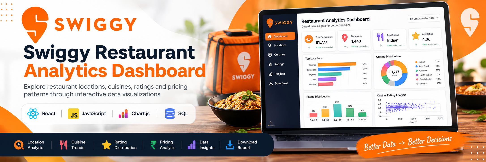
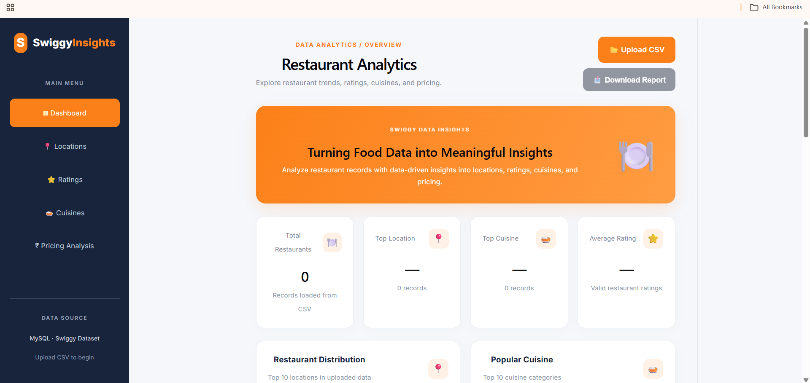

# 🍽️ Swiggy Restaurant Analytics Dashboard


<p align="center">

  

</p>


<p align="center">

  <b>Interactive Restaurant Data Analytics Dashboard built with React, JavaScript, and Chart.js</b>

</p>


<p align="center">

  Analyze restaurant locations, cuisines, ratings, pricing patterns, and data-quality anomalies from 81K+ Swiggy restaurant records.

</p>


<p align="center">

  <a href="https://swiggy-dashboard-sooty.vercel.app/">🚀 Live Demo</a>

  &nbsp;&nbsp;|&nbsp;&nbsp;

  <a href="https://github.com/Harshitha0501/swiggy-dashboard">💻 GitHub Repository</a>

</p>


---


## 📸 Dashboard Preview


<p align="center">

  

</p>


---


## 📌 Project Overview


The **Swiggy Restaurant Analytics Dashboard** is an interactive web application designed to transform restaurant dataset records into meaningful visual insights.


The dashboard allows users to upload a CSV dataset and dynamically analyze:


- Restaurant distribution by location

- Popular cuisine categories

- Restaurant rating distribution

- Average ratings for higher-cost restaurants

- Highest recorded restaurant costs

- Data-quality anomalies

- Overall dataset statistics


The application processes the uploaded CSV directly in the browser and automatically recalculates the dashboard insights.


---


## 🚀 Live Demo


👉 **[View Live Dashboard](https://swiggy-dashboard-sooty.vercel.app/)**


> Upload the Swiggy CSV dataset to explore the interactive analytics dashboard.


---


## ✨ Key Features


### 📊 Interactive Analytics


- Analyze **81,777 restaurant records**

- View restaurant distribution by location

- Identify frequently occurring cuisine categories

- Analyze rating distribution across defined rating ranges

- Compare higher-cost restaurants with their average ratings


### 📂 CSV Data Processing


- Upload restaurant data through CSV

- Parse CSV data directly in the browser

- Automatically recalculate dashboard metrics

- No backend database required for dashboard analysis


### 📈 Data Visualization


- Interactive charts using **Chart.js**

- Location distribution visualization

- Cuisine analysis

- Rating distribution charts

- Cost vs. rating analysis


### ⚠️ Data Quality Analysis


- Detect unusually high recorded cost values

- Highlight potential data-quality anomalies

- Allow unusual values to be validated against the original dataset


### 📥 Analytics Report


- Generate a downloadable `.txt` analytics report

- Includes dataset statistics and calculated insights

- Useful for quick analysis and documentation


### 📱 Responsive Interface


- Clean dashboard layout

- Responsive design

- Sidebar-based navigation

- Suitable for desktop and smaller screens


---


## 📊 Dashboard Insights


### 📍 Restaurant Distribution


Identifies locations with the highest number of restaurant records.


### 🍛 Cuisine Analysis


Analyzes cuisine categories and identifies the most frequently occurring cuisines within the dataset.


### ⭐ Rating Distribution


Restaurants are grouped into the following rating ranges:


| Rating Range | Description |

|---|---|

| 0.0–2.9 | Lower rating range |

| 3.0–3.9 | Moderate rating range |

| 4.0–4.4 | High rating range |

| 4.5–5.0 | Very high rating range |


### ₹ Pricing Analysis


Calculates the average restaurant rating for restaurants with a recorded cost of **₹500 or more**.


### ⚠️ Data Quality Alert


Highlights the highest recorded restaurant cost so potentially unusual values can be reviewed against the original source data.


---


## 📌 Key Dataset Statistics


| Metric | Value |

|---|---:|

| Total Restaurant Records | 81,777 |

| Dataset Fields | 10 |

| Data Source | Swiggy Restaurant Dataset |

| Processing | CSV / Browser |

| Visualization | Chart.js |


### Dataset Fields


```text

id

name

city

cuisine

rating

rating_count

cost

lic_no

link

address

```


> Dashboard insights are calculated dynamically from the CSV file uploaded by the user.


---


## 🛠️ Tech Stack


| Technology | Purpose |

|---|---|

| React | Frontend user interface |

| JavaScript | Application logic and data processing |

| Chart.js | Interactive data visualization |

| React Chart.js 2 | Chart.js integration with React |

| PapaParse | CSV parsing |

| CSS | Dashboard styling |

| Vite | Development and build tool |

| Git | Version control |

| GitHub | Source code management |

| Vercel | Deployment |


---


## 🖥️ Dashboard Modules


The application includes the following sections:


```text

Dashboard Overview

│

├── Restaurant Distribution

├── Popular Cuisine

├── Rating Distribution

├── Cost vs Rating Analysis

├── Data Quality Alert

├── CSV Upload

└── Analytics Report

```


---


## 📥 Analytics Report


After uploading the dataset, users can select:


**📥 Download Report**


The application generates:


```text

swiggy-analysis-report.txt

```


The report contains:


- Dataset information

- Total restaurant records

- Top restaurant location

- Top cuisine

- Average rating

- Rating distribution

- ₹500+ cost group average rating

- Highest recorded cost

- Top locations

- Top cuisines


---


## 🔄 Project Workflow


```text

Swiggy Dataset

      ↓

MySQL Data Cleaning

      ↓

SQL Analysis

      ↓

CSV Export

      ↓

React Dashboard

      ↓

CSV Data Processing

      ↓

Interactive Visualizations

      ↓

Analytics Report

```


---


## 📂 Project Structure


```text

swiggy-dashboard/

│

├── public/

│   └── images/

│       ├── swiggy-dashboard-banner.png

│       └── dashboard-overview.png

│

├── src/

│   ├── components/

│   ├── App.jsx

│   ├── main.jsx

│   └── ...

│

├── package.json

├── vite.config.js

└── README.md

```


---


## 💻 Run Locally


### 1. Clone the repository


```bash

git clone https://github.com/Harshitha0501/swiggy-dashboard.git

```


### 2. Navigate to the project


```bash

cd swiggy-dashboard

```


### 3. Install dependencies


```bash

npm install

```


### 4. Start the development server


```bash

npm run dev

```


### 5. Open the application


Vite will provide a local development URL similar to:


```text

http://localhost:5173/

```


---


## 🔗 Related Project


### Swiggy SQL Analysis


This dashboard is the visualization companion to my MySQL-based Swiggy restaurant analysis project.


The SQL project covers:


- Restaurant location analysis

- Cuisine analysis

- Rating distribution

- Pricing patterns

- Cost vs. rating analysis

- Data-quality investigation


👉 **[View Swiggy SQL Analysis](https://github.com/Harshitha0501/Swiggy-SQL-Analysis)**


---


## 🎯 Project Objectives


This project demonstrates practical experience with:


- Data cleaning and preparation

- SQL-based data analysis

- CSV data processing

- Frontend development with React

- Data visualization

- Interactive dashboard development

- Data-quality investigation

- Git and GitHub

- Application deployment


---


## 📚 What I Learned


Through this project, I practiced:


- Building reusable React components

- Processing large CSV datasets in a frontend application

- Creating interactive charts with Chart.js

- Designing a responsive analytics dashboard

- Connecting SQL analysis with frontend visualization

- Identifying and presenting potential data-quality issues

- Deploying a React application using Vercel


---


## 👩‍💻 Author


### Harshitha C.


**Software Developer | Aspiring Data Analyst**


<p>

  <a href="https://github.com/Harshitha0501">GitHub</a>

  &nbsp;•&nbsp;

  <a href="https://www.linkedin.com/in/harshitha-c2605/">LinkedIn</a>

</p>


---


## ⭐ Project


If you find this project useful, feel free to explore the repository and the related SQL analysis project.


**Built with React, JavaScript, Chart.js, SQL, and data analytics.**